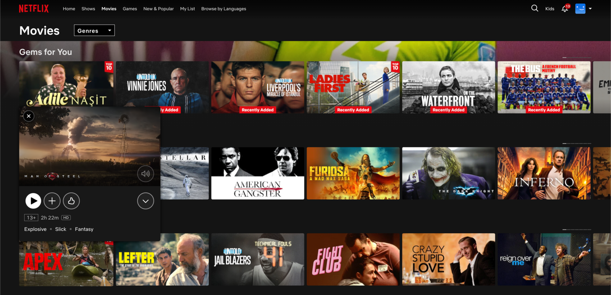

# WatchedOut

> *"Wait — I already watched this. Why is it still here?"*

  

You know that feeling.

You open Netflix to find something new. The first row is half stuff you already finished. So is the second. And the third. By the time you give up scrolling, twenty minutes have passed and you're rewatching *The Office* for the fourth time. Again.

**WatchedOut fixes that.**

---

## What it does

Hover over any title on Netflix → click the **×** → it's gone.

From the homepage. From search. From the genre pages. From the giant preview modal that pops up when you accidentally hover. **Everywhere.**

The hidden titles live locally on your device. Open the extension popup any time to see what you've hidden, restore individual titles, or wipe the whole list and start over.

No accounts. No logins. No syncing to a server. Your watch history stays where it belongs — on your machine.

---

## Why

Netflix's recommendation engine thinks *"you watched it"* = *"you might like to watch it again."*

Sometimes that's true. *(Looking at you, comfort shows.)*

Often it isn't. You finished a 6-season drama. You don't need it pinned to your homepage for the next two years. WatchedOut gives you the off-switch the Netflix UI forgot to ship.

---

## Install (Developer mode)

1. **Download** this repo: green *Code* button → *Download ZIP* → unzip. (Or `git clone` it.)
2. Open Chrome and go to `chrome://extensions`
3. Toggle **Developer mode** in the top-right corner
4. Click **Load unpacked** and select the unzipped folder
5. Open [netflix.com](https://www.netflix.com), hover any card, and click the **×** in the corner

That's it. To see your hidden list, click the WatchedOut icon in the Chrome toolbar.

> Chrome Web Store release coming soon.

---

## How it works

- **Manifest V3** Chrome extension. ~250 lines of vanilla JS, no dependencies, no build step.
- A content script injects a `×` button into every Netflix card it finds, and a larger one into the preview modal that opens on hover.
- A `MutationObserver` watches for new cards as Netflix lazy-loads them while you scroll.
- Hidden title IDs are stored in `chrome.storage.local` and synced live between the popup and every open Netflix tab.
- A CSS `:has()` rule + DOM ancestor traversal collapses the empty slider slot left behind, so the row tightens up instead of leaving a gap.

If you want to read the code, it's all right here — `content.js` is the brain.

---

## Privacy

- Everything stays on your device.
- No analytics, no telemetry, no tracking.
- No data is ever sent to a server — there is no server.
- The extension only requests permission for `storage` and only runs on `netflix.com`.

Read the manifest. Read the source. That's the whole stack.

---

## Disclaimer

This is an independent, third-party browser extension. It is **not affiliated with, endorsed by, sponsored by, or connected to Netflix, Inc.** in any way.

"Netflix" is a trademark of Netflix, Inc. WatchedOut interacts with the Netflix web interface for personal use only and does not modify Netflix's services, content, or data on Netflix's servers.

---

## License

[MIT](LICENSE) — do what you want with it. If it makes your Netflix nicer, that's enough.

---

Made by [Utku Kuşcu](https://github.com/utkukuscu) — because I got tired of seeing the same shows every time I opened Netflix.
